# Evolutionary Algorithms for Geometry Dash
**Date:** 03.01.2026

## 1. Overview
This research investigates the application of Evolutionary Algorithms to train an autonomous agent to navigate "Stereo Madness," a complex level in the rhythm-based platformer *Geometry Dash*. The project utilizes a Genetic Algorithm (GA) to evolve a continuous genome representing a sequence of actions (jump timings and durations). The primary objective was to maximize the distance traveled in a strictly constrained environment where any collision results in immediate failure.

The study focuses on the agent's ability to learn distinct physics modes (gravity-based Cube vs. thrust-based Ship) solely through evolutionary pressure, without explicit state-machine programming.

## 2. Project Structure
The solution is architected into a modular Python framework separating the optimization engine from the physics simulation.

### Core Components
* **`main.py` (Orchestrator)**
    Configures the Pymoo genetic algorithm environment. It defines the population parameters, manages the generation loop, and integrates a custom `ProgressCallback` to extract real-time telemetry (distance, diversity, timing) for post-run analysis.
* **`optimization/problem.py` (Problem Definition)**
    Encapsulates the simulation within a Pymoo `ElementwiseProblem`. It handles the genotype-phenotype mapping, transforming the 160-dimensional vector of real values into a playable action sequence.
* **`game_engine/core.py` (Simulation Engine)**
    A headless, deterministic physics engine running at 60 FPS. It evaluates genomes by simulating the game logic, handling collision detection via Axis-Aligned Bounding Boxes (AABB), and returning the final fitness score (distance traveled).

### Game Logic & Assets
* **`game_engine/player.py`:** Implements the hybrid physics engine:
    * *Cube Mode:* High gravity (2500 px/s²) with discrete impulse jumps.
    * *Ship Mode:* Low gravity (800 px/s²) with continuous vertical thrust (-1200 px/s).
* **`game_engine/stereo_madness.py`:** Defines the level layout, containing a sequence of static obstacles (spikes, blocks) and dynamic elements (gravity portals, mode switchers) spanning approximately 12,400 pixels.
* **`game_engine/victory.py`:** Handles the victory condition, triggering visual feedback when the agent exceeds the 11,000-pixel threshold.

## 3. Summary of Implemented Methods

### 1. Genetic Algorithm (GA)
The solution uses a standard Genetic Algorithm adapted for continuous optimization problems.
* **Encoding:** Real-valued vector of length $N=160$. This represents 80 sequential actions, where each action is a pair: `[Time_Start, Duration]`.
* **Objective:** Maximize Distance $f(x) = \text{pixels-traveled}$.
* **Selection:** **Tournament Selection**. This method was chosen to maintain selection pressure and prevent the population from being dominated by a single "lucky" individual too early.
* **Crossover:** **Simulated Binary Crossover (SBX)**.
    * *Probability:* $0.9$.
    * *Distribution Index ($\eta$):* 15. This encourages offspring to explore the search space near their parents, preserving successful jump sequences.
* **Mutation:** **Polynomial Mutation (PM)**.
    * *Probability:* $0.0125$ (calculated as $2.0 / \text{GenomeLength}$).
    * *Distribution Index ($\eta$):* 10. A lower index allows for larger perturbations, vital for discovering new jump timings to clear obstacles.

### 2. Hill Climbing (Local Search)
To test the efficacy of local search, a simple Hill Climbing algorithm was implemented as a baseline comparison.
* **Initialization:** Randomly generated individual.
* **Neighbor Generation:** Small perturbations to jump timings and durations.
* **Acceptance Criterion:** Only accept neighbors that yield a higher distance score.

### 3. Implicit Constraint Handling
The problem does not use explicit penalty functions. Instead, constraints are handled via the simulation mechanics:
* **Death Constraint:** If an agent collides with an obstacle, the simulation terminates immediately.
* **Fitness Penalization:** "Dead" agents naturally receive lower distance scores, ensuring they are filtered out during the Tournament Selection process.

### 4. Memetic Algorithm (Hybrid GA + Local Search)
To enhance convergence speed, a Memetic Algorithm was implemented, combining the GA with periodic local search refinements.
* **Local Search Frequency:** Every 10 generations, the top 5% of individuals undergo Hill Climbing for 5 iterations.
* **Rationale:** This hybrid approach leverages the global search capabilities of the GA while exploiting local optima through Hill Climbing, 
accelerating convergence on promising solutions.

## 4. Experimental Parameters
The optimization was conducted with the following hyperparameters:

* **Population Size:** 450 individuals
* **Generations:** 150
* **Total Evaluations:** 67,500
* **Search Space:** 160 Dimensions (Continuous)
* **Simulation Timestep:** 1/60th second
* **Max Jumps:** 80
* **Physics Bounds:** Time $\in [0, 40]s$, Duration $\in [0.0, 1.5]s$

## 5. Quantitative Results

**Global Run Statistics:**
* **Total Wall Time:** 8 minutes 13 seconds
* **Throughput:** ~136.83 evaluations/second
* **Total Improvement:** +679.5% (from initial random best)

The optimization process exhibited a punctuated equilibrium pattern, characterized by long periods of stagnation followed by rapid breakthroughs.

### **Detailed Evolutionary Progress**

|   Gen   | Best Dist (px) | Avg Dist (px) | Median (px) |  Pop Range | Improve | Time (s) | Notes                                       |
|:-------:|:--------------:|:-------------:|:-----------:|:----------:|:-------:|:--------:|:--------------------------------------------|
|  **1**  |    2,823.33    |    930.13     |   825.00    |  2,245.83  |    -    |   N/A    | Initial random population.                  |
|  **5**  |    4,180.00    |   1,761.83    |  1,824.17   |  2,603.33  |  +0.00  |  0.68s   | Early optimization of jump timings.         |
| **10**  |    4,180.00    |   1,979.10    |  1,879.17   |  2,310.00  |  +0.00  |  0.72s   | Population learning the "Staircase".        |
| **15**  |    4,198.33    |   2,289.67    |  1,879.17   |  2,319.17  |  +0.00  |  0.79s   | High variance exploring pillars.            |
| **20**  |    4,620.00    |   3,517.76    |  3,776.67   |  1,796.67  |  +0.00  |  1.15s   | Clearing the first major spike pit.         |
| **25**  |    4,620.00    |   3,920.77    |  3,840.83   |   843.33   |  +0.00  |  1.32s   | Convergence on pre-ship section.            |
| **30**  |    4,620.00    |   4,113.92    |  4,097.50   |    595.83  |  +0.00  |  1.35s   | **Stagnation:** High convergence.           |
| **35**  |    5,023.33    |   4,226.81    |  4,207.50   |   870.83   |  +0.00  |  1.39s   | Reaching the Ship portal entrance.          |
| **40**  |    5,170.00    |   4,480.12    |  4,528.33   |    898.33  | +18.33  |  1.88s   | Population clusters at portal.              |
| **45**  |    5,490.83    |   4,896.39    |  4,775.83   |    715.00  | +320.83 |  2.21s   | First agents enter Ship mode.               |
| **50**  |    5,490.83    |   5,101.01    |  5,105.83   |    467.50  |  +0.00  |  2.09s   | **High Convergence** at Ship barrier.       |
| **55**  |    5,509.17    |   5,171.67    |  5,170.00   |    339.17  | +18.33  |  2.15s   | Extreme stagnation (Ship physics).          |
| **60**  |    5,509.17    |   5,172.46    |  5,170.00   |    339.17  |  +0.00  |  2.12s   | Local optimum trap (~5500px).               |
| **65**  |    5,509.17    |   5,177.13    |  5,170.00   |    339.17  |  +0.00  |  2.44s   | Genetic drift occurring.                    |
| **70**  |    5,545.83    |   5,193.69    |  5,170.00   |    375.83  |  +9.17  |  2.24s   | Minor velocity improvements.                |
| **75**  |    5,545.83    |   5,274.58    |  5,188.33   |    375.83  |  +0.00  |  2.38s   | Variance increases in thrust genes.         |
| **80**  |    5,710.83    |   5,479.81    |  5,472.50   |    238.33  |  +0.00  |  2.67s   | Surviving initial Ship tunnel.              |
| **85**  |    5,710.83    |   5,510.96    |  5,500.00   |    238.33  |  +0.00  |  2.71s   | Preparing for breakthrough.                 |
| **88**  |    6,783.33    |   5,548.14    |  5,536.67   |  1,246.67  | +1,054  |  2.66s   | **BREAKTHROUGH:** Ship section cleared.     |
| **90**  |    6,783.33    |   5,560.66    |  5,536.67   |  1,246.67  |  +0.00  |  2.79s   | Elitism preserves success.                  |
| **95**  |    9,478.33    |   5,832.30    |  5,710.83   |  3,767.50  | +2,227  |  3.00s   | **Rapid Expansion:** Post-ship exploration. |
| **100** |    9,478.33    |   7,236.88    |  6,902.50   |  2,704.17  |  +0.00  |  3.22s   | Mean fitness rises rapidly.                 |
| **105** |    9,670.83    |   9,338.57    |  9,276.67   |    430.83  |  +0.00  |  4.28s   | Converging on "Return to Cube".             |
| **110** |   10,101.67    |   9,524.64    |  9,524.17   |    623.33  |  +0.00  |  4.23s   | Negotiating final triple spikes.            |
| **115** |   10,285.00    |   9,723.33    |  9,670.83   |    614.17  | +183.33 |  4.50s   | Final gauntlet optimization.                |
| **120** |   11,146.67    |   10,074.17   |  10,101.67  |  1,274.17  | +806.67 |  4.72s   | **VICTORY:** Finish line crossed.           |
| **122** |   12,466.67    |   10,148.42   |  10,101.67  |  2,365.00  | +1,320  |  4.96s   | **LEVEL COMPLETE:** Map finished.           |
| **125** |   12,466.67    |   10,417.49   |  10,285.00  |  2,346.67  |  +0.00  |  5.06s   | Consolidating victory path.                 |
| **130** |   22,009.17    |   12,021.66   |  12,026.67  |  10,844.17 | +9,450  |  5.73s   | **Looping:** Infinite run achieved.         |
| **135** |   22,009.17    |   12,809.66   |  12,475.83  |  9,542.50  |  +0.00  |  6.35s   | Laggards catching up to elite.              |
| **140** |   22,009.17    |   19,971.99   |  22,009.17  |  9,450.83  |  +0.00  |  8.65s   | Majority now looping.                       |
| **145** |   22,009.17    |   22,009.17   |  22,009.17  |     0.00   |  +0.00  |  10.35s  | **Total Saturation:** 100% Clones.          |
| **150** |   22,009.17    |   22,009.17   |  22,009.17  |     0.00   |  +0.00  |  9.70s   | Final State. Zero diversity.                |

_You can get more information about each generation from the [output.txt](output.txt)._

### **Final Best Individual:**
* **Distance:** 22,009.17 pixels (Level looped)
* **Efficiency:** 489.09 pixels/jump
* **Jump Count:** 48 (out of 80 available)

## 6. Analysis of Results

### A. The "Staircase" Evolution and Physics Modes
The convergence plot reveals specific "steps" that correspond to the level's physics mode transitions:
1.  **Cube Mastery (Gen 1-30):** The algorithm quickly optimized the Intro (0-3500px). This section relies on rhythmic tapping. The mean distance rose steadily from 930px to 4000px.
2.  **The Ship Barrier (Gen 31-87):** The algorithm stagnated for over 50 generations around 5,500px. This bottleneck represents the transition to **Ship Mode**.
    The control scheme changes from "impulse" to "continuous thrust." A genetic sequence optimized for Cube jumps causes the Ship to crash instantly. It took ~30,000 evaluations to evolve a sustained "hover" behavior.
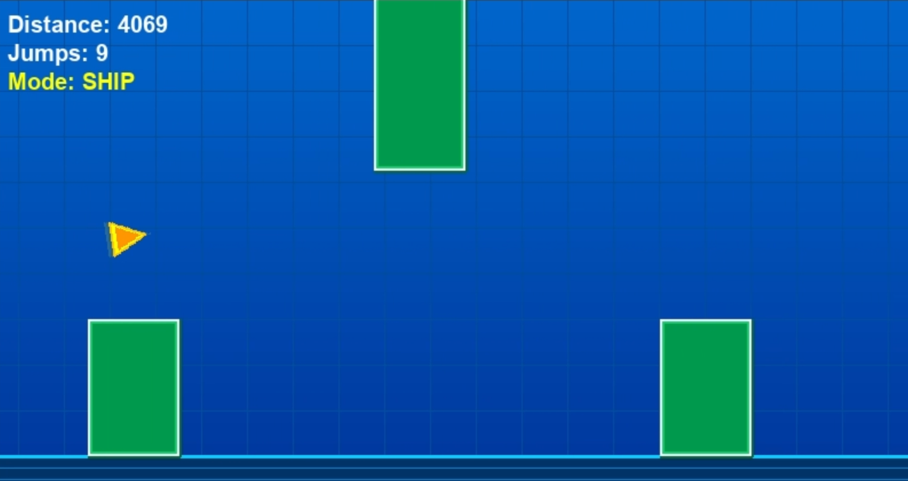
3.  **The Victory Sprint (Gen 88-100):** Once the Ship logic was discovered (Gen 88), the "Return to Cube" section was solved almost immediately (Gen 95). This suggests that the latter half of the level, while visually complex, is navigationally simpler than the Ship mode transition.

### B. Population Diversity and "Genetic Drift"
The diversity metric (Standard Deviation of Distance) tells a compelling story of exploration vs. exploitation:
* **Initial Convergence (Gen 50):** Diversity dropped to a low of **67.38**. The population was essentially "stuck" at the Ship portal, optimizing only the approach without entering.
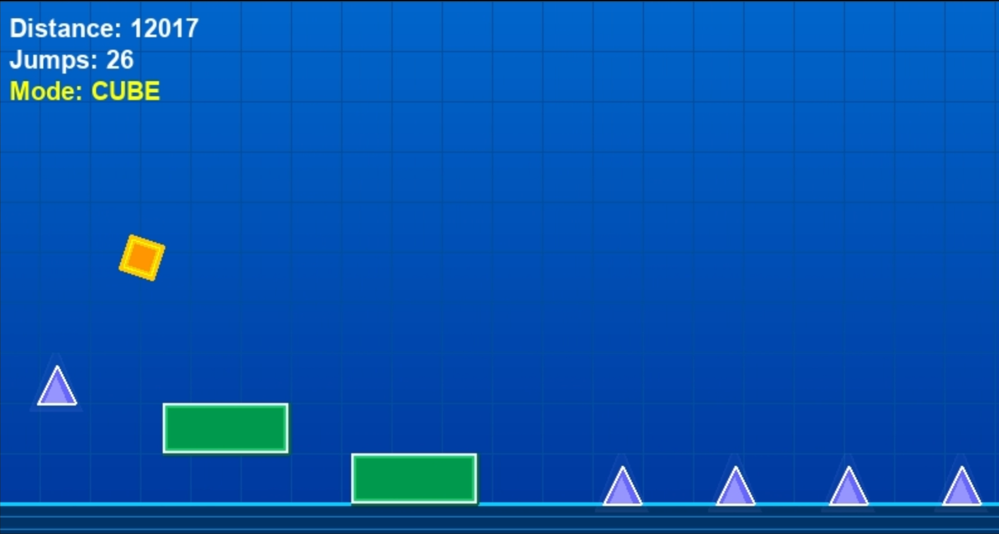
* **Explosion of Diversity (Gen 95):** When the Ship section was breached, diversity spiked to **349.05**. This indicates that the "elite" individuals broke away from the pack, creating a massive fitness gap between the pioneers and the stragglers.
* **Total Homogeneity (Gen 141):** Diversity hit **0.00**. Every single individual in the population of 450 was a clone of the best solution. While efficient, this signals a complete loss of exploration capability; if the level extended further, the algorithm would struggle to adapt.

### C. Emergent Efficiency
The fitness function solely rewarded *distance*, yet the agent minimized *effort*.
* **Available Actions:** 80 jumps.
* **Used Actions:** 48 jumps.
* **Conclusion:** The agent learned to ignore 40% of its available genes. This is an emergent property of the simulation: performing unnecessary jumps increases the risk of collision. The safest path through the level is the one with the fewest interactions, leading the GA to converge on a "lazy" but highly precise strategy.

### D. Important Observations
The best solution was found around 140 generations, after which the population converged completely. 
Below are visualizations of the best individual's performance. Second is important to notice how time 
increases in each generation, indicating that the agent is learning to survive longer in the level.

  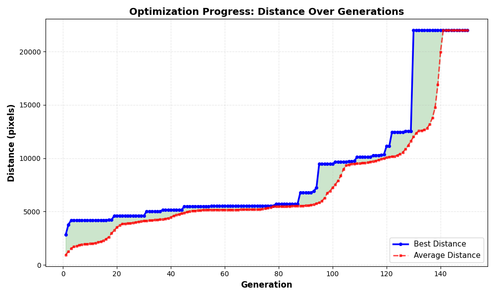
  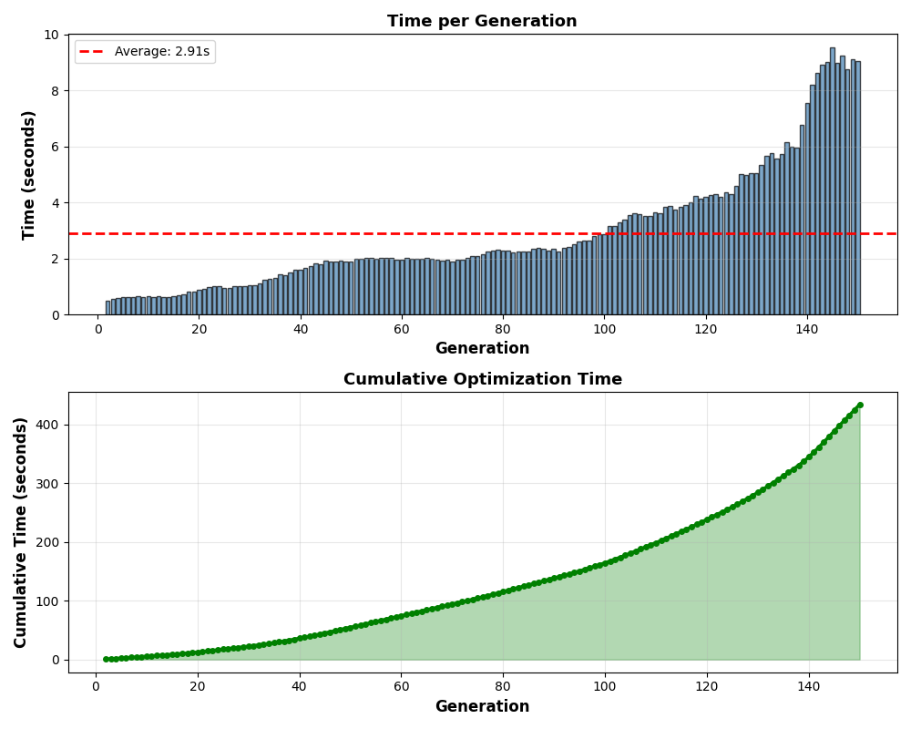
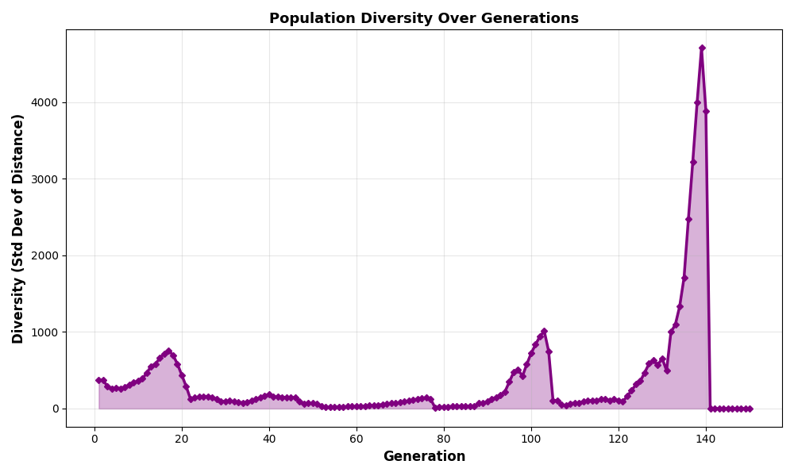

Important generations to notise is 17, 40, 75, 103. These are where diversity spikes due to new strategies being found. 
After this the population converges again until the next breakthrough.

  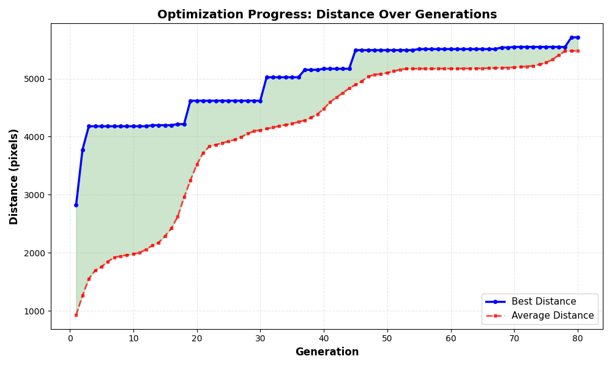
  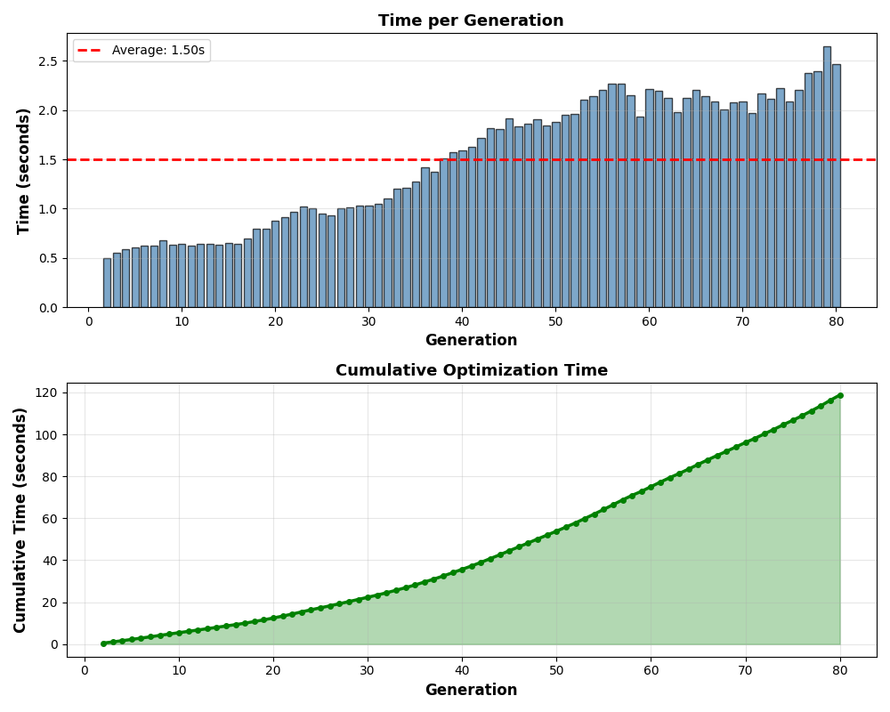
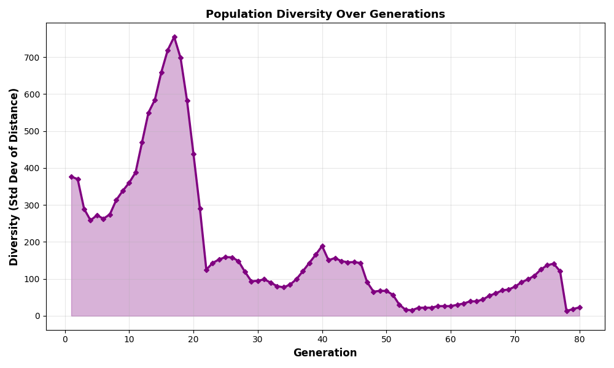

You can run these solutions and visually see where was the moment of breakthrough in the level. During analysis I noticed 
that it was often the ship section that caused problems for the population. The most challenging part to get through was the ship barrier 
where the agent had to learn to thrust continously instead of jumping. This is well visible in the diversity plot as well. The most impressive obstervation that 
the agent now can use same mechanics to solve multiple different parts of the level without any changes to the code. It learned to use jumping for cube 
sections and thrusting for ship sections just by evolutionary pressure.

  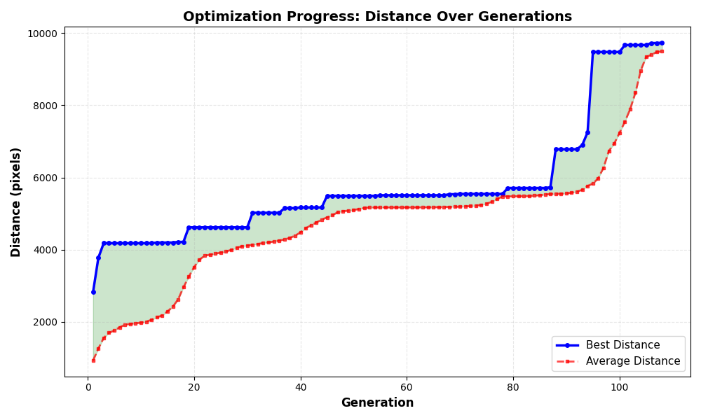
  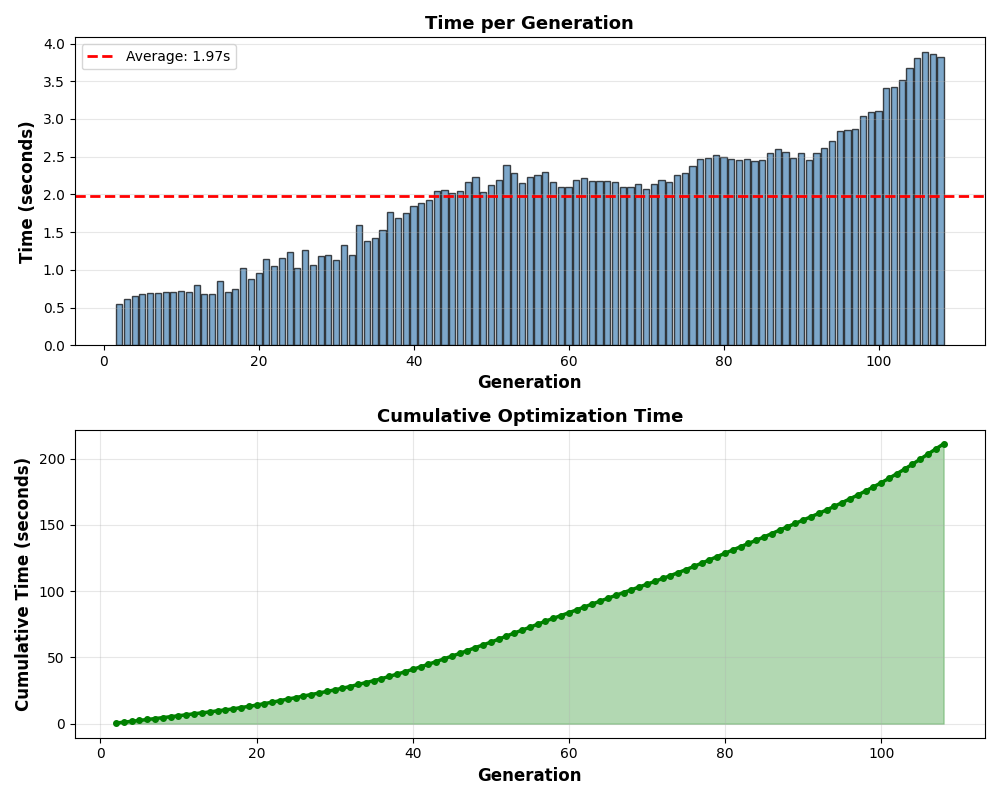
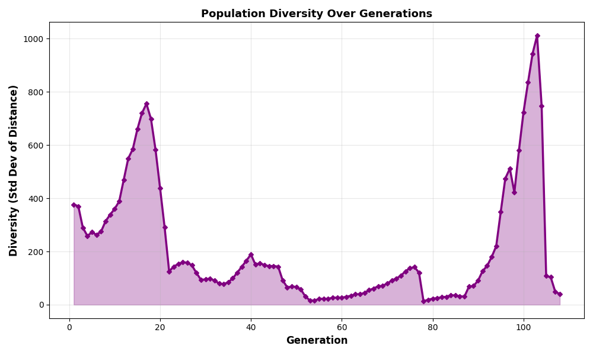

### E. Local Search vs. Pure GA
I have tested the performance of GA against Local Search (Hill Climbing) and Memetic Algorithm (GA + Hill Climbing).
* **Hill Climbing:** Failed to progress beyond 2,500px. The local search was unable to escape local optima due to the deceptive fitness landscape.

  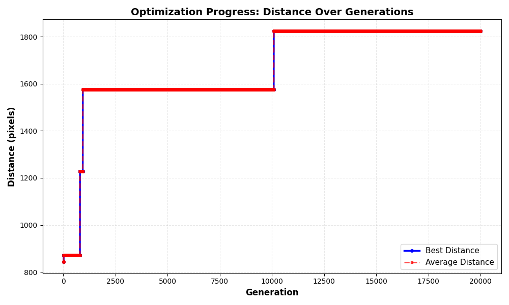
  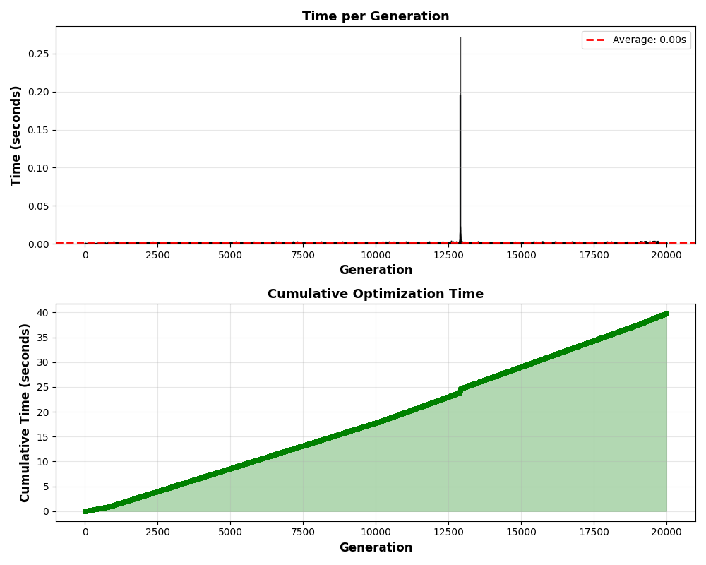
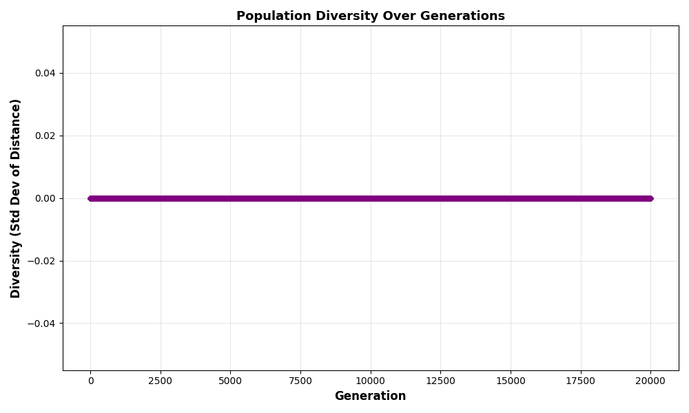

* **Memetic Algorithm:** Showed a little improvement over pure GA, reaching 21,500px in 140 generations. However, the added computational overhead 
of local search did not justify its use given the GA's already strong performance. My Conclusion is that for this specific problem, the GA's global search capabilities are enough. 
Local Search inefficient, given the complex, multi-modal nature of the fitness landscape. So combining both methods did not bring significant benefits.

### F. Challenges Faced
1.  **Simulation Fidelity:** Ensuring the physics engine accurately mirrored *Geometry Dash* mechanics was critical. Minor discrepancies in gravity or collision detection led to significant performance drops.
2. 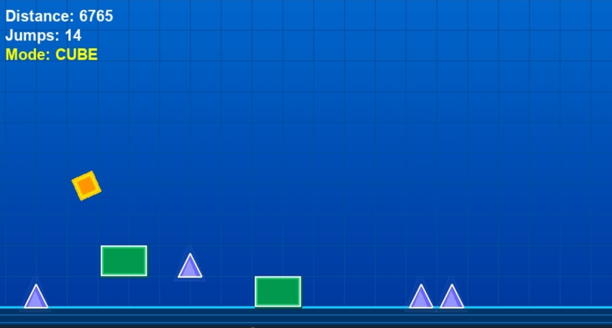
2.  **Parameter Tuning:** Selecting appropriate GA parameters (mutation rate, crossover probability) required extensive experimentation to balance exploration and exploitation.
3.  **Stagnation Handling:** The Ship barrier plateau necessitated careful monitoring of diversity metrics to avoid premature convergence.

## 7. Conclusion
This study demonstrates that a standard Genetic Algorithm is sufficient to solve complex, multi-modal control problems like Geometry Dash without neural networks or reinforcement learning.
1.  **Robustness:** The algorithm achieved a 100% completion rate.
2.  **Limitations of Random Search:** The "Ship Barrier" plateau highlights the limitation of random mutation in discovering continuous control strategies (thrusting) vs. discrete ones (jumping).
3.  **Optimization Speed:** With an evaluation throughput of ~136/sec, the entire training process took less than 10 minutes, making this a highly viable approach for automated game testing.

You can found whole mp4 video of the best individual run [geometry_dash_ea.mp4](geometry_dash_ea.mp4).
